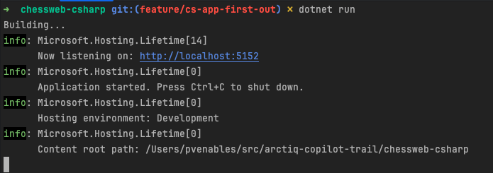
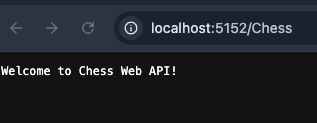

# The Conversion Journey with Copilot

Having already created an application in Node.js, I set about getting Copilot to help me convert it to C#.

## First Steps

My first prompt after loading up the IDE with Copilot and the project was the following:

```prompt
Hi, I have a nodejs application in the workspace folder chessweb-node 
that I would like to create a c# version of. 
Can you help me get started?
```

The response instructed to create the basic structure of a project in C#, 
folders, project initialization, and a basic class.

Having done all that I started the application with:

```shell
dotnet run
```



After realizing the default URL was actually '/Chess', I found the app 
running locally at http://localhost:5152/Chess



Not very impressive but it's proof of life for our little project. 

