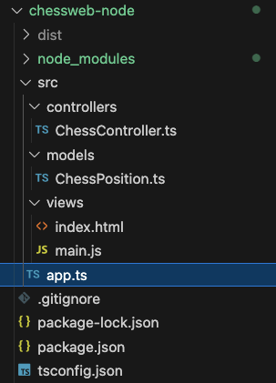
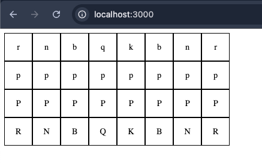
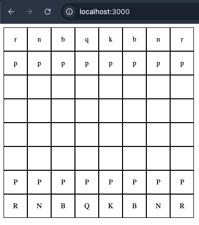
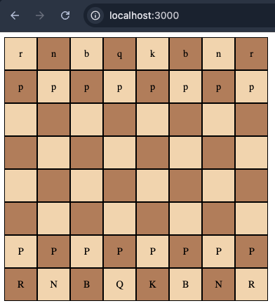
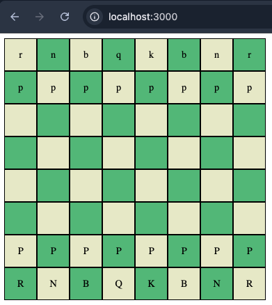
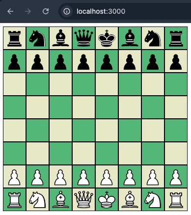
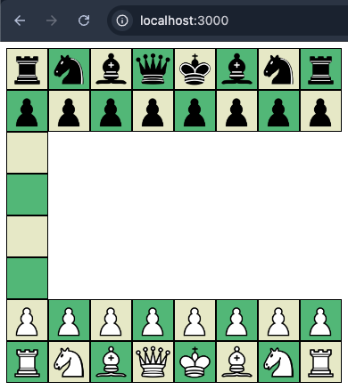

# Explanation

This document is a play-by-play of creating a typescript Chessboard viewer app.

## Beginnings

I started by giving Copilot this prompt:

```prompt
I am beginning a typescript application using MVC. 
This will be a web application that gives users a pictorial display 
of a Chess position read in and saved to FEN Chess notation. Can you 
provide a starting point for this project?
```

I got a series of instructions about initializing a node and typescript application and the following file structure represents all the created items:


Figure 1: initial file structure

With the exception of `main.js` and `.gitignore` these were the files and directories given by copilot.

Running the app I saw a blank screen when going to `localhost:3000` as instructed.

I inquired with copilot where `main.js` was defined in its answer and it updated to give me the contents of `main.js` and a slight adjustment to `app.ts`. I made these changes and reloaded to see:


Figure 2: Output of the initial application

This was checked into a branch called "feature/node-app" as the absolute minimal runnable.

## Making a recognizable Chess board

Not very impressive but we have some key features of a Chessboard in place. Note that there are Black and White pieces represented by their FEN equivalents: lowercase for black and uppercase for White. *P*awn, *R*ook, *B*ishop, k*N*ight, *Q*ueen, and *K*ing.

But it's missing the empty squares of the board. Back to copilot.

I asked it:

```prompt
The output of this application only outputs the squares of the 
chessboard where there are pieces set. Can we fix that?
```

After applying the code fix to `main.js` I was greeted with the following:


Figure 3: Updated Chessboard view.

I further prompted Copilot with:

```prompt
The next problem is that the chessboard does not have alternating 
dark and light squares. I would like to fix that.
```

This resulted in two changes, one for `main.js` to alternately style the cells with CSS classes and the other for `index.html` to add the new style classes.

Now the board looks like:


Figure 4: Coloured board view.

I didn't like the colours it chose, so I modified that quickly:


Figure 5: Updated colour scheme

Now We need to get those letters translated into images. I gave Copilot a prompt as:

```prompt
I would like to have the chess piece letter representations 
replaced by images. Let's make that change next.
```

A couple of changes again to `main.js` and `index.html` along with the required setup of images which Copilot left up to me. 

I put the images in place and after finding the right location: `views/images` and updating the folder to include a theme `wikipedia` (for the source of the images) and fixing the code to refer to the images by Colour THEN piece type (wB.png for White Bishop). We got a pretty natural chessboard look:


Figure 6: Chessboard with piece images

Now I want to be able to move the pieces. I gave Copilot this prompt:

```prompt
Can we make the pieces movable? For example, I want to 
click on a piece and be able to drop it on another spot 
on the board. This should replace the image of the piece 
that is there if there is one and otherwise just move the 
image from source square to destination square.
```

Copilot gave me an updated method for `renderChessboard` to include HTML5 Drag and Drop functionality. I implemented the changes and loaded up the board to see the first real bug:


Figure 7: A bug!

I provided Copilot with a description of the problem and a request for a fix:

```prompt
I encountered a problem with the chessboard. It doesn't render any of the squares from b3-b6 across to h3-h6.
```

Copilot helpfully identified the problem and fixed it.

The next problem I discovered is in how the pieces move. At this point the following has been observed:

- Pieces can only be moved once
- Moving a piece to one of the first two ranks causes it to disappear
- Pieces that have been moved cannot be replaced and the taking piece disappears

I decided to try to fix these one at a time. I prompted it to fix the first problem:

```prompt
I've noticed that once a piece has been moved, it loses 
its ability to be moved again. Can we persist this ability 
to move once a piece has been moved?
```

I was given a code update to the eventHandler for the `handleDrop` method. I applied it and tested but there was no change to the behaviour. I sent it back to Copilot for comment.

```prompt
Unfortunately, this did not fix the behaviour. The pieces 
still cannot be moved once they have been moved.
```

I got another fix but it did not correct the behaviour. I also noticed some new behaviour:

- After a piece disappears and you try to re-move another piece, the disappeared piece appears in the target square (but only if you try to move a pawn...)

I went back to Copilot for a fix to the first bug.

```prompt
This did not fix the bug. The pieces do have the 
draggable="true" property but they cannot be moved 
once they have been moved a first time.
```

Copilot gave me more of a fix to update the source squares with the drag and drop handlers. This also did not fix the problem.

I argued with Copilot a little bit insisting that the problem was not fixed and it continued to give me the same solution to the problem happily providing identical code to fix the current code. I used the javascript developer console to debug it myself.

I found that the piece was not getting its board position updated after being dropped. I brought this back to Copilot for consideration:

```prompt
I've noticed that the dragged piece is not getting 
its data-position value set after being dropped. 
It retains its original square coordinates.
```

And that fixed the first bug of the program! It also fixed the other bugs observed so far.

This was checked into a branch called "feature/checkpoint-one-first-bugfix"

## Adding Rules

I knew this couldn't be mistaken for any kind of useful thing until we had some rules for piece movement in place. I need rules to govern things like:

- Blocking replacement of a player's own pieces
- Movement according to normal piece movement rules
- Special rules like *en passant* and *castling*
- Preventing moves that would create an illegal position (e.g moving into check)

I asked Copilot to begin with the first one:

```prompt
Now I need to define some rules for piece movement. 
The first rule should be that pieces cannot replace 
pieces of the same colour.
```

The initial test that Copilot came up with involved testing if the image source filename had a `w` in it. This test failed because the files are all in a directory called `wikipedia` and it was a poor test. I asked it to refactor the test to look at the case of the piece's alternate text which is set to the FEN equivalent. This is a safer test because all lowercase alt text will be black pieces.

This basic rule is complete.

### Pawn Movement Rules

I quickly moved onto pawn movement rules. It was a quick process. I prompted Copilot with:

```prompt
The next rule I need to implement is legal piece 
movement. Pawns have special rules in that they 
normally only move one square forward. On their 
first move they can move two squares forward, and 
they can only take a piece that is one square 
diagonally in front of them.
```

Copilot found the correct modification in the first try. I checked this into a branch called "feature/node-app-pawn-rules"
