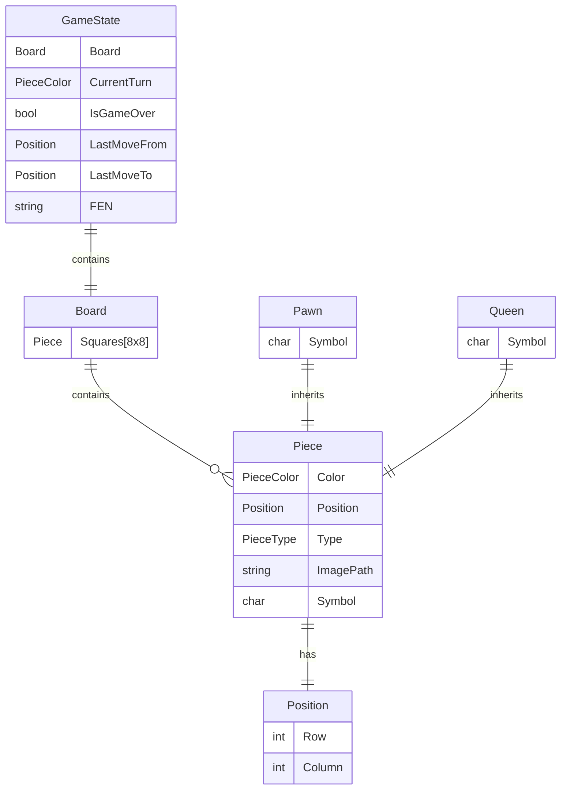
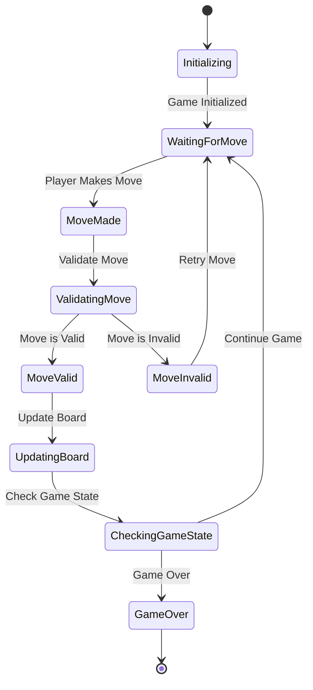

# Diagrams

## Entity-Relationship Diagram

```mermaid
erDiagram
    GameState {
        Board Board
        PieceColor CurrentTurn
        bool IsGameOver
        Position LastMoveFrom
        Position LastMoveTo
        string FEN
    }

    Board {
        Piece Squares[8x8]
    }

    Piece {
        PieceColor Color
        Position Position
        PieceType Type
        string ImagePath
        char Symbol
    }

    Pawn {
        char Symbol
    }

    Queen {
        char Symbol
    }

    Position {
        int Row
        int Column
    }

    GameState ||--|| Board: contains
    Board ||--o{ Piece: contains
    Piece ||--|| Position: has
    Pawn ||--|| Piece: inherits
    Queen ||--|| Piece: inherits
```

## State Diagram

```mermaid
stateDiagram-v2
    [*] --> Initializing
    Initializing --> WaitingForMove: Game Initialized
    WaitingForMove --> MoveMade: Player Makes Move
    MoveMade --> ValidatingMove: Validate Move
    ValidatingMove --> MoveValid: Move is Valid
    ValidatingMove --> MoveInvalid: Move is Invalid
    MoveValid --> UpdatingBoard: Update Board
    UpdatingBoard --> CheckingGameState: Check Game State
    CheckingGameState --> GameOver: Game Over
    CheckingGameState --> WaitingForMove: Continue Game
    MoveInvalid --> WaitingForMove: Retry Move
    GameOver --> [*]
```
