# Lab 2: Development Use Cases

## Prerequisites

To participate in this lab you will need to have one of the following IDEs setup and ready for use:

- [Microsoft VSCode](https://code.visualstudio.com/)
- [JetBrains Rider](https://www.jetbrains.com/rider/)
- [Microsoft Visual Studio](https://visualstudio.microsoft.com/)

Additionally, your chosen IDE should have the necessary Copilot extension installed and authenticated to work with your GitHub account.

- [GitHub: How to set up Copilot in various IDEs](https://docs.github.com/en/copilot/managing-copilot/configure-personal-settings/configuring-github-copilot-in-your-environment)

### Runtime Environment

The primary example in this repository for this lab is written in C#. As such, you will need to install and be able to run the ASP.NET 9.0 Framework.

- [ASP.NET 9.0 Download](https://dotnet.microsoft.com/en-us/download)

### Development Tools

Acquiring the code can be accomplished via GitHub as a compressed archive or using `git`.

- [Download Git SCM](https://git-scm.com/downloads)

### Lab Source Code

In order to work from the same source code as in this lab, you will need to either have this repository checked out from GitHub or have downloaded the Archive file for the appropriate stage of the lab.

## Estimated time

- 45 minutes

## Objectives

In this lab we are going to talk about how to use Copilot to get the most out of it. We are going to learn how to use Github Copilot for common development use cases. We are going to look at how to do these things and how to sidestep some of the challenges you might experience while using Copilot.

- Explaining code and errors
- Writing documentation
- Adding a feature to the codebase

While learning about doing these things we will talk about improving the output of Copilot both by applying the prompt crafting methods previously discussed and the best-practices when encountering issues like:

- missing or changed elements of code
- hallucinations
- incomplete or naive implementations
- stalling and repetitive answers

## Step 1 - Common Problems and Solutions

First, a little more theory. Based on the prompts you have crafted and fed into Copilot, or the amount of code you are working with, you may or may not get the results you wanted. There are a number of ways in which Copilot's answers can fall short of expectations. Commonly you may see it:

- stalls on autocomplete
- repeats itself
- deviates from existing code in answer
- omits or hallucinates content
- provides an obsolete or dated answer
- gives a naive or inefficient solution
- retracts an answer that matches public code

### Copilot Stalls on Autocomplete

- It can happen that Copilot does not start or provide an answer when it seems clear to the user that they are pausing for a suggestion. This happens most often in the inline copilot suggester. The simple fix here is to give it a little push by starting either a comment or a method and it should trigger copilot.

### Copilot Repeats Itself

- It can also happen that Copilot will regenerate the same content over and over again as if it has forgotten that it just gave that code. This is a form of hallucination error and does illustrate why copilot is not in the driver's seat. It requires an experienced user to scrutinize the suggested code and decide if it should be incorporated into the codebase or if more context is required.

### Deviates from Existing Code in Answer

- As the developer you must carefully review the code provided by Copilot as the full example, if given, may not be an appropriate replacement for the code in place. Copilot may have chosen to change the implementation slightly from what is currently in place. This may be ok or you may wish to not allow your logic to drift away from its familiar form especially if the affected code is not part of the changes you are making. You can ask copilot to avoid changing the original code as much as possible or only show the changed code. It is, in any event, advisable to carefully review suggestions to make sure they agree with your codebase before replacing. Also, ensuring the releavant files are in scope of Copilot Chat when the prompt is given can help keep Copilot on track.

### Omits or Hallucinates Content

- Copilot might refactor variable names in its answer. It is not clear why it does this nor why it might omit statements that exist in your method body but, again, this outlines why user review of all suggestions are necessary. An inability to understand the answers given by Copilot are a recipe for a quagmire of code that does not work.

- Copilot might also omit a large body of code that appears in the answer to simplify the answer and draw your attention to the changed code. IN all cases you need to understand what you are accepting into your codebase from Copilot.

### Provides an Obsolete or Dated Answer

- By virtue of the fact that the model Copilot was trained on has a cutoff date, this means that some answers may be inaccessible to Copilot. In these cases, familiarity with the newer components and frameworks will be essential for the developer to provide that oversight.

### Gives a Naive or Inefficient Answer

- Copilot may answer a tricky question with a simple, effective, but inefficient answer. It often finds an answer that meets the objectives but if efficiency isn't a stated goal in the prompt, it may not prioritize that and the developer will need to re-request that the answer be optimized in the way they desire. The lesson is that you cannot assume Copilot will always choose the optimal solution-- it's goal is to meet the prompt and if efficiency isn't specified it might settle on the simplest answer.

### Retracts an Answer that Matches Public Code

- One setting in your GitHub account or Organization is the toggle that Copilot will filter results that match public code. This means that if it generates an answer that happens to match a public code solution for the same thing it will retract the answer. This can be very frustrating and actually fairly common. The simple solution to this is to add to the prompt the phrase "Do not match public code." This informs Copilot that it should attempt to originate a new answer specifically avoiding a public code match. It really works.

Keep these practices in mind when submitting prompts to Copilot. You will see many of these issues.

## Step 2 - Explaining Code and Errors

- Perhaps one of your first forays into using Copilot will be to use it to gain a basic understanding of a codebase or segment of code that is unclearly documented or otherwise unfamiliar to you. It just so happens that we have a project from which to start such an exploration. The first "command" we can use to focus the intent of our prompt is the `/explain` command. This informs Copilot that the desire is for a specific kind of response focused on a detailed explanation of the selection, file, or message.

- You can trigger an inline request for code explanation by pressing the hotkey that opens Copilot inline and issuing the command `/explain` along with additional prompt cues.

    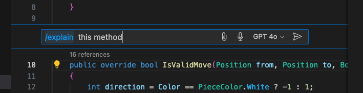

    Figure 1: Prompting to explain inline in VSCode

- You can, of course, prompt from an inline location or using the Copilot Chat sidebar. This can be helpful if the program logic is not very clear or unnecessarily convoluted.

    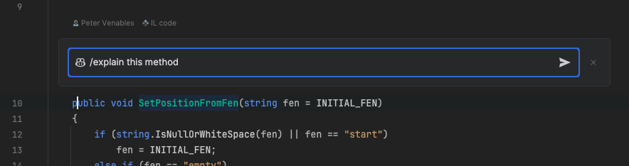

    Figure 2: Prompting to explain a method inline in Rider

- The `/explain` keyword can be used to help understand cryptic error messages returned by the runtime or the build process. In VSCode the Copilot Chat can be directed to access `@terminal` with the keyword `/explain` to review the error output.

    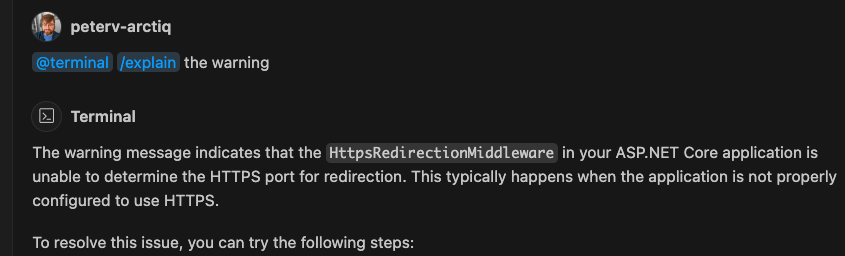

    Figure 3: Requesting an explanation in VSCode to a build warning in the terminal.

- In IDEs that do not support the `@terminal` agent, you can cut-and-paste error messages into the chat window to include as part of the prompt.

    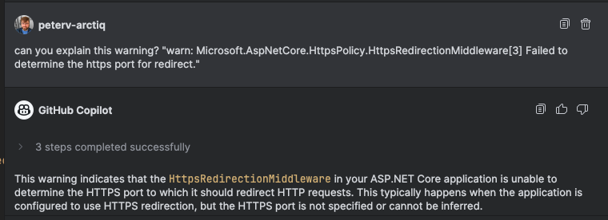

    Figure 4: Requesting an explanation in JetBrains Rider to a build warning.

## Step 3 - Writing Documentation

- In terms of documentation, Copilot can relieve a lot of tedium. Copilot can generate documenation for you and it can adopt your particular style of documentation given enough examples to work from. So write a few comments yourself and Copilot will resume in a consistent way. The special command for this activity is `/doc`.

- If starting without any existing examples, it can be helpful to refer to a standard style.

    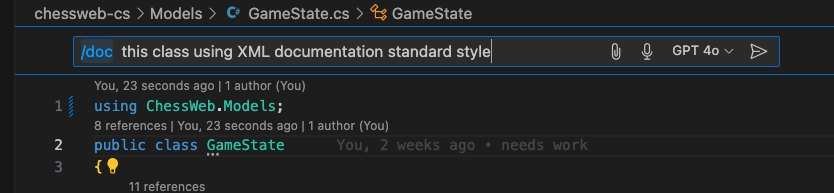

    Figure 5: Starting documentation (VSCode)

- Once you have an example, Copilot can pick up the hint. Your inline suggestions should align with other examples:

    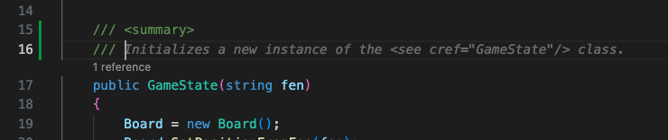

    Figure 6: Inline Commenting Suggestions

- Another trick to use when generating documentation is to ask Copilot to create [Mermaid.js](https://mermaid.js.org/) diagrams. In this way you can have quick diagramming of Entity-Relationships, Classes, Interactions, etc. (See [Example Diagrams](Diagrams.md)) You will need to have an extension in your IDE that supports Mermaid diagrams to view them.

    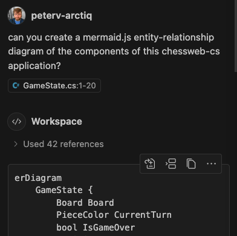

    Figure 7: A request for a mermaid-based entity-relationship diagram.

- The following is an example of a Mermaid diagram that Copilot generated for the chess Web Application:

    ```mermaid
    erDiagram
    GameState {
        Board Board
        PieceColor CurrentTurn
        bool IsGameOver
        Position LastMoveFrom
        Position LastMoveTo
        string FEN
    }

    Board {
        Piece Squares[8x8]
    }

    Piece {
        PieceColor Color
        Position Position
        PieceType Type
        string ImagePath
        char Symbol
    }

    Pawn {
        char Symbol
    }

    Queen {
        char Symbol
    }

    Position {
        int Row
        int Column
    }

    GameState ||--|| Board: contains
    Board ||--o{ Piece: contains
    Piece ||--|| Position: has
    Pawn ||--|| Piece: inherits
    Queen ||--|| Piece: inherits
    ```

## Step 4 - Adding a Feature to the Codebase

### The ChessWeb Codebase

- Our example application is called ChessWeb. It is a simple Web Application designed to have just enough complexity in its function to be an interesting target for Copilot work. It can be found in the repository under chessweb-cs (C#), chessweb-node (NodeJS), and chessweb-java (Java).

- This sample application is far from a complete Chess-playing interface. In fact, all it does is to provide a view of a Chess board that allows turn-based moves to be entered with very basic piece rules applied. It serves as a basis for extension using Copilot. If you don't have knowledge of or interest in Chess, don't worry, no expertise is required to participate in this part.

- Let's take a look at what we have:

- We can start the application by entering the `chessweb-cs` directory and running it.

    ```bash
    cd chessweb-cs
    dotnet run
    ```

- If successful we can now open a browser to the URI `http://localhost:5111` and see something like this:

    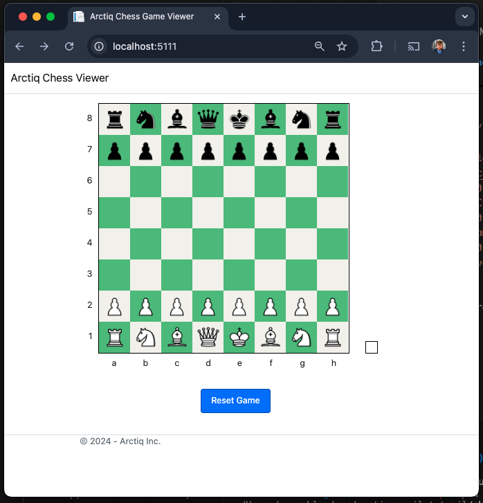

    Figure 8: Application Startup View

- In this view we can see a familiar Chess board with pieces set up for the beginning of a game. There is a button that can be used to reset the position. The board is labeled on the ranks and files: ranks are labeled 1-8 and files are labeled a-h. Finally, there is a turn indicator to the right of the board that will display which side and which colour is due to play.

### Extending the Game State Display

- A reasonable feature to add is a display of the current board position in a standard text-based representation known as Forsyth-Edwrads Notation or FEN. This is a text encoding that can be used to rebuild a Chess position and represent the current game state in both a human and machine-readable fashion. You can read more about FEN [here](https://en.wikipedia.org/wiki/Forsyth%E2%80%93Edwards_Notation).

- I will give Copilot a suitable prompt to begin this change:

    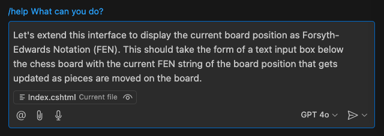

    Figure 9: Prompting for a FEN display box

    ```prompt
    Let's extend this interface to display the current board position as 
    Forsyth-Edwards Notation (FEN). This should take the form of a text 
    input box below the chess board with the current FEN string of the board 
    position that gets updated as pieces are moved on the board.
    ```

- We can expect a reponse similar to this from our prompt:

    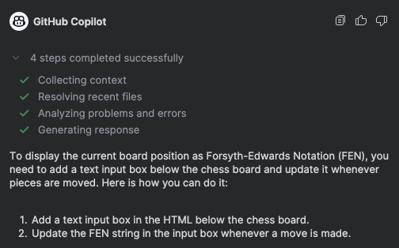

    Figure 10: A response from Copilot to our prompt

- Of course the response from Copilot will come with code as well. Any code that comes out of this will need to be reviewed and integrated into your codebase.

- The first suggestion should have been to add an element to the chessboard view to house the FEN string display. You can compare to this example and apply as needed. 

    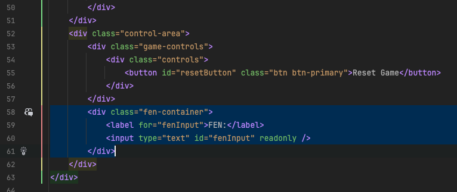

    Figure 11: Code to add to index.cshtml for FEN container

- Note that the name of the CSS class for the FEN container may not have been in context (it's defined in webroot/css/chess.css) and not named correctly in the Copilot response. Just ensure it's named like the above and you're good to go.

- If for some reasons the response from Copilot is not as expected, you can prompt Copilot for more information. For example, you can ask Copilot how to update the FEN string so that it always represents the current board position.

    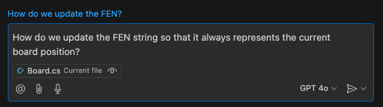

    ```prompt
    How do we update the FEN string so that it always represents the current board position?
    ```

- The response from Copilot should now include a method to generate the FEN string and update the FEN string in the `GameState` class. It should also include updating the FEN string in the view.

### Making the UI Update

- When we load the app and check the behaviour we also note that the FEN strong does not update. Of course we are updating the state but that state never gets propagated to the page view. We'll have to fix that as well. 

    

    ```prompt
    I need the page view to automatically update the fen input with the updated FEN string when a move is made.
    ```

- Note that `index.cshtml`, `GameController.cs`, and `GameState.cs` are explicitly included in scope for the query.

- The response from Copilot involves creating a javascript call in the index.cshtml to fetch the FEN from the response from the move action-- which doesn't exist yet so it also provides an update to the GameController to return the FEN that we previously added to the class.

### Adding Tests for the New Feature

- Copilot can also generate tests for the new feature. You can prompt Copilot to generate tests for the new feature by asking it to generate unit tests for the new feature.

    

    ```prompt
    Can you generate unit tests for the new feature?
    ```

- The response from Copilot should include a few unit tests for the new feature. Create a new file named `BoardTests.cs` in the `Tests` folder and add the tests to the file.

- To run the tests, you can use the following command:

    ```bash
    dotnet test
    ```

### Congratulations you've completed it! 🎉
